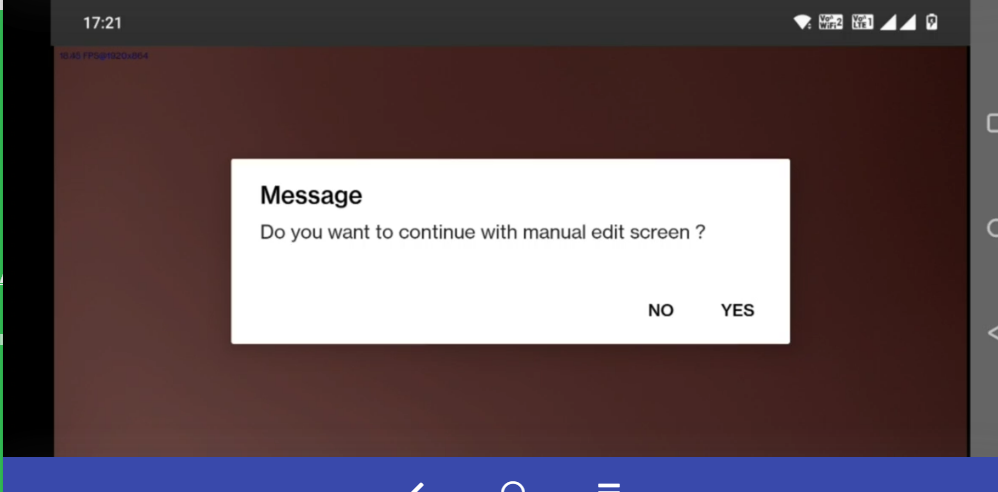
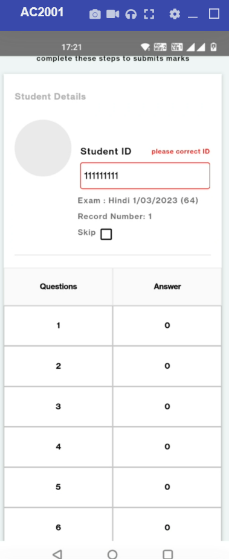

# Improved Low light Performance - Manual Edit

Saral App is used in the field to collect data, but the challenge is in few places where there is low lighting or layout format challenge  causing difficulty to scan layout. So once user login to Saral App, and isManualEditEnabled flag is set, Scanning Layout for a duration more than the set time defined by scanTimeoutMs shows a popup\

"Do you want to continue with manual edit screen ?". On clicking yes user can enter/edit data manually.\

This feature is available from v1.5.9 release and above.






Manual Edit option can be controlled by following configuration:
```
isManualEditEnabled - boolean
scanTimeoutMs - integer
```

`isManualEditEnabled` is a boolean property in `/schools/login` API response. if it's set to true then Manual Edit process will be enabled.\
`scanTimeoutMs` is an integer property in `/schools/login` API response. It specifies the scanning timeout.\

`/schools/login`  API response with `isManualEditEnabled` and `scanTimeoutMs` configuration reference.

```
{
"school" : {
    "storeTrainingData" : true,
    "name" : "Dummy school 4",
    "schoolId" : "u002",
    "state" : "up",
    "autoSynch" : true,
    "autoSynchFrequency" : 9000,
    "autoSyncBatchSize": 20,
    "isManualEditEnabled": true,
    "scanTimeoutMs": 60000
}
}
```
