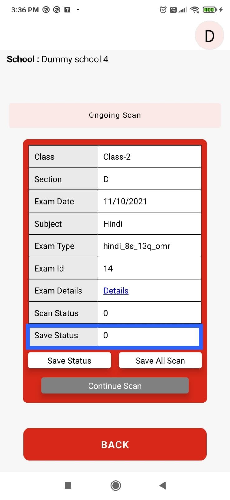
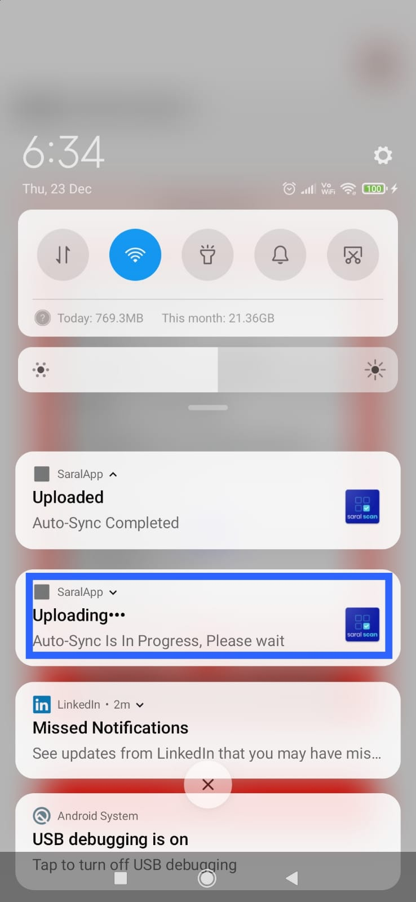

# Auto Sync

Saral App is used in the field to collect data, but the challenge is in few remote places there is no internet connectivity all the time. So once useres login to Saral App, scanned data is initially stored in mobile local storage. Users can manually sync data to Saral backend by clicking on the `Save All Scans` button. `Auto Sync` feature polls data in local storage at a frequency and pushes it to the backend.&#x20;

This feature is available from `v1.0.0-beta.5` release and above.

.jpeg>)

&#x20; .jpeg>)

Auto Sync can be controlled by following configuration:

```
autoSynch - boolean
autoSynchFrequency - integer
autoSyncBatchSize - integer
```

`autoSynch` is a boolean property in `/schools/login` API response. if it's set to true then Auto Sync process will be enabled.

`autoSynchFrequency` is frequency at which auto-synch to be executed.&#x20;

`autoSyncBatchSize` is batch size for auto-sync functionality. Auto-sync triggers based on number of records available in local storage. if its minimum of `autoSyncBatchSize` and other configuration matches, auto sync to backend will be triggered in mobile app. Default value if not set is 10.

`/schools/login` API response with `autoSynch` and `autoSynchFrequency` configuration reference.

```
{
"school" : {
    "storeTrainingData" : true,
    "name" : "Dummy school 4",
    "schoolId" : "u002",
    "state" : "up",
    "autoSynch" : true,
    "autoSynchFrequency" : 9000,
    "autoSyncBatchSize": 20
}
}
```

