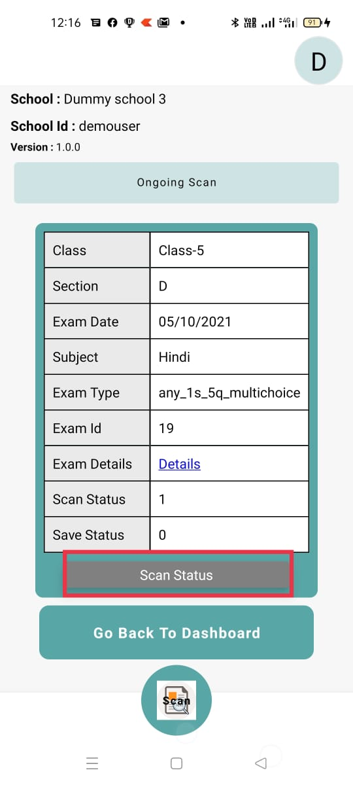
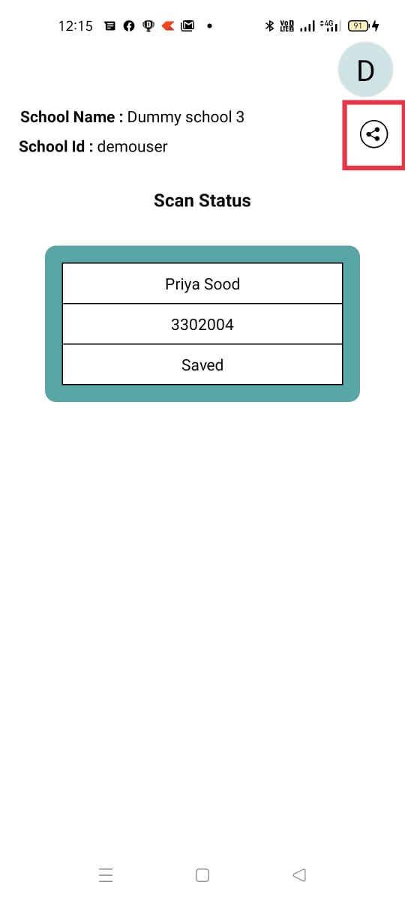
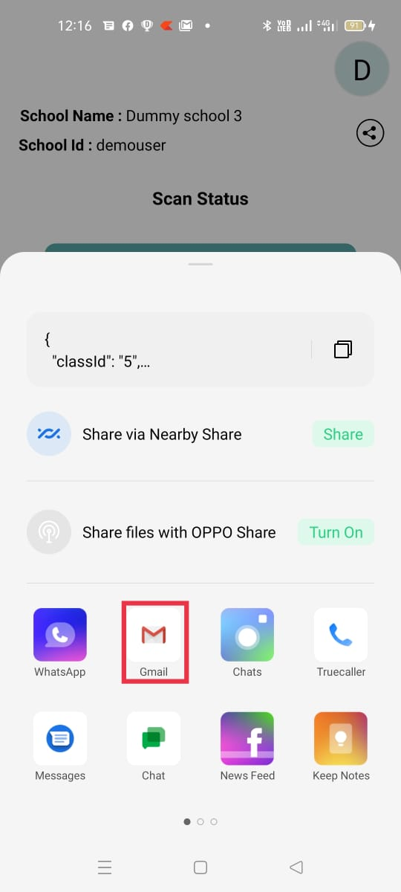
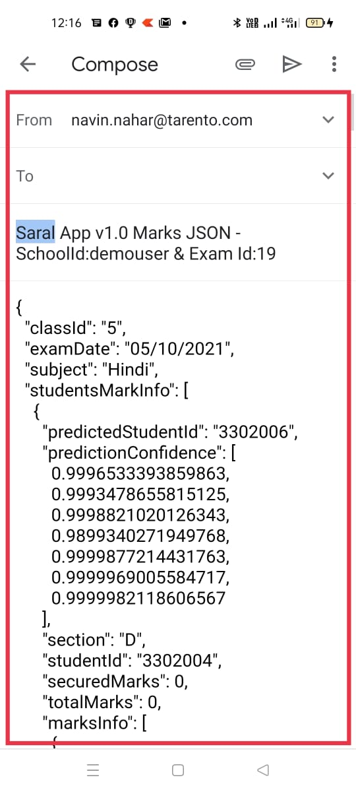

# Share App data

This feature is useful to troubleshoot issues with Saral App captured data and backend sync-up issues. Users can share this info with the support team directly for troubleshooting issues.

This feature is a quick way to share the AI/ML training data with the support team from the field to help improve accuracy with handwritten digits predictions.

This feature is available from `v1.0.0-beta.4` release and above.

