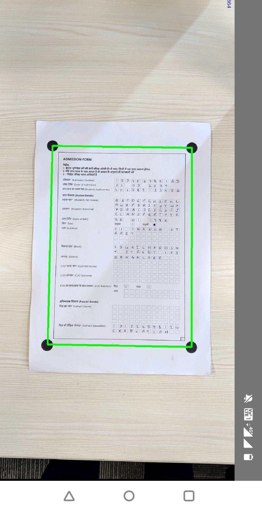

# Vertical layout scan

Saral App supports Vertical page(potrait) layouts from `v1.6.3` release. [layout-specification.md](../specifications/layout-specification.md "mention") supports adding `verticalScanLayout` element to true/false to indicate if layout need to be scanned vertically(potrait mode).This support is added to `SaraSDK`.&#x20;



Example below shows roi of vertically scannable layout where `verticalScanLayout` is set to true.&#x20;

```
"layout": {
      "version": "1.0",
      "name": "AdmissionFrom",
      "pages": "2",
      "threshold": {
          "experimentalOMRDetection": false,
          "minWidth": 0,
          "minHeight": 0,
          "detectionRadius": 12,
          "verticalScanLayout": true
      },
      "cells": [
          {
              "cellId": "1",
              "page": "1",
              "rois": [
                  {
                      "annotationTags": "ADDMISSIONNUMBER_1",
                      "extractionMethod": "NUMERIC_CLASSIFICATION",
                      "roiId": "1",
                      "index": 0,
                      "rect": {
                          "top": 108,
                          "left": 217,
                          "bottom": 116,
                          "right": 229
                      }
```
