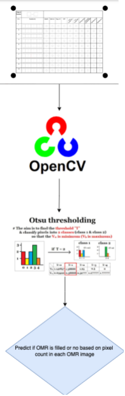

# Application Architecture

**Overall Architecture**

* [ ] Refer [`CQube`](https://cqube.sunbird.org)for documentation
* [ ] Saral uses [Tensorflow Lite](https://www.tensorflow.org/lite) AI/ML model embedded within Android Application for predicting Handwritten digits.
* [ ] Each layout is configurable in the backend as JSON. Refer [layout-specification.md](specifications/layout-specification.md "mention") and[layout-configuration.md](../use/layout-configuration.md "mention") for more details.

**Saral SDK and Application Architecture**

* [ ] [**Saral SDK**](../engage/saral-sdk-source-code-repository.md) is an Android and React Native Software Development kit with core logic to predict  handwritten digits and OMR bubbles.
* [ ] [**Saral SDK**](../engage/saral-sdk-source-code-repository.md) accepts layout JSON as input and enriches the JSON with predictions and sends back the response. Refer [layout-specification.md](specifications/layout-specification.md "mention")
* [ ] [**Saral SDK**](../engage/saral-sdk-source-code-repository.md) component can be reused for Android and React Native App development with handwritten digits and OMR bubbles prediction capabilities.

**Handwritten Digits ML Model**

Handwritten Digits Machine Learning model is build using Python,Keras ,Tensor-flow technologies.

This Machine Learning model is built on [Resnet164](https://arxiv.org/abs/1603.05027) Architecture.

To embed this model in Android SDK/Application , its converted from HDF5 to TFLite format.

Model is trained on MNIST Handwritten digits open data-set along with handwritten digits from the field.

[OpenCV](https://opencv.org/) is used for capturing ROI’s(Region Of Interest) and processing images before passing them to ML model for prediction.

.gif>)

**OMR(Optical Mark Recognition) Detection**

For OMR detection [Saral SDK](https://saral.sunbird.org/engage/saral-sdk-source-code-repository) uses OpenCV Computer Vision Technology to capture answer sheet images , sub-divide them into individual ROI(Region of Interest Images).

Individual ROI(Region Of Interest) images of answer sheet are processed using [OTSU thresholding](https://learnopencv.com/otsu-thresholding-with-opencv/) in OpenCV and predict if OMR bubble is filled or unfilled using pixel count.

