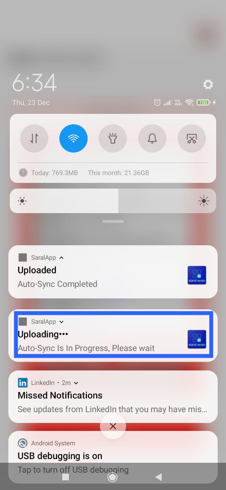

# Auto Sync

Saral App is used in the field to collect data, but the challenge is in few remote places there is no internet connectivity all the time. So once useres login to Saral App, scanned data is initially stored in mobile local storage. Users can manually sync data to Saral backend by clicking on the `Save All Scans` button. `Auto Sync` feature polls data in local storage at a frequency and pushes it to the backend.&#x20;

This feature is available from `v1.0.0-beta.5` release and above.

.jpeg>)

&#x20; .jpeg>)
