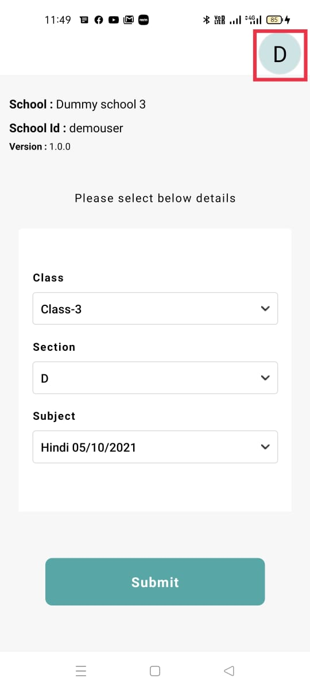
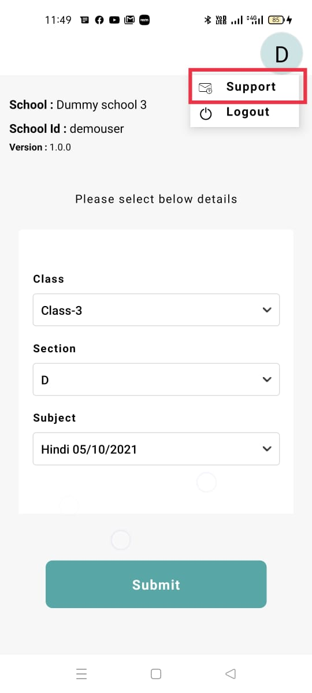
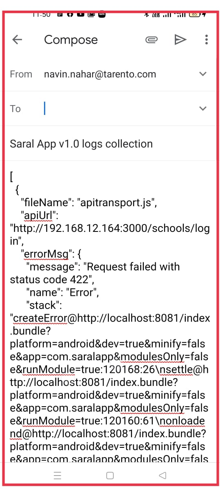

# Support

As Saral App is an edge location solution to collect data from the field. So when there are issues with data collection, this feature is helpful to quickly share failures from logs with the support team. Its recommended sharing these logs with the implementation support team to look into the failure and identify the root cause.

This feature is available from `v1.0.0-beta.4` release and above.

.jpeg>)

