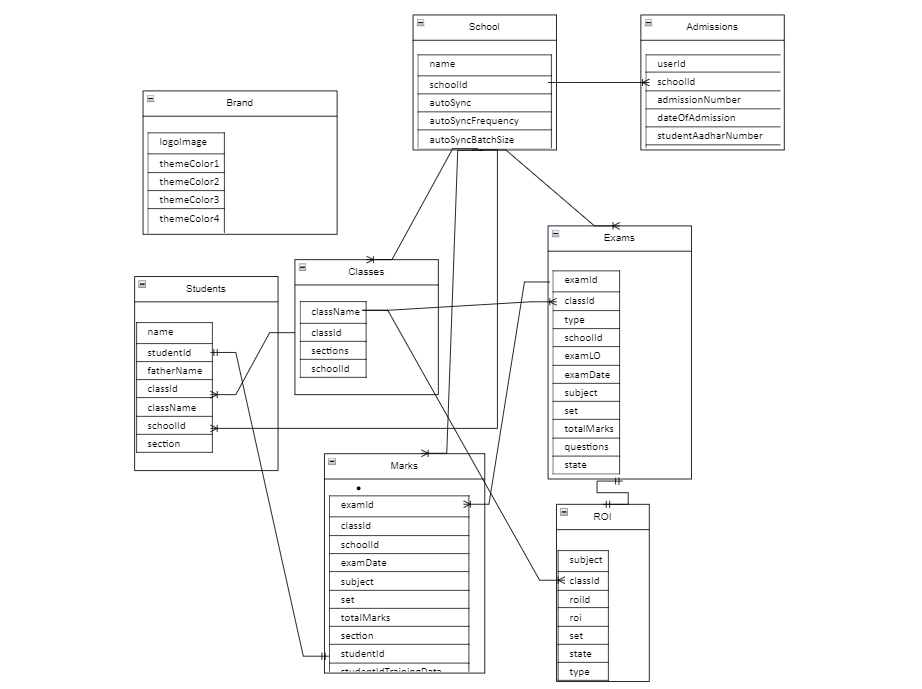

# Alternatives for Saral components

## **Alternatives for Saral components:**

Saral uses a variety of components in order to enable a set of workflows. The choice of these has been driven by the needs for the initial set of workflows that the Saral reference solution enables. These choices however, are to be based on adopter needs and an adopter can choose to use alternative components, if that is what their requirements dictate. This section captures a few details on how two components can be replaced by alternatives.

#### Table of content

1. [How to Migrate Saral backend to use Postgresql instead of MongoDB](saral-components-alternatives.md#how-to-migrate-saral-backend-to-use-postgresql-instead-of-mongodb)
2. [Open-Source alternative for Firebase Analytics](saral-components-alternatives.md#open-source-alternative-for-firebase-analytics)

\
\

## **How to Migrate Saral backend to use Postgresql instead of MongoDB**

This guide explains high level steps on how to switch from MongoDB to another alternative - PostgreSQL as the database for your Saral backend application using Sequelize. Sequelize is an ORM (Object-Relational Mapping) for Node.js, providing a higher-level abstraction over SQL databases.

### **Prerequisites**

* Node.js installed on your system
* PostgreSQL installed and running on your system

### **Steps**

#### **1. Install Necessary dependency:**

* To use postgresql install node libraries like **sequelize, pg, pg-hstore**

#### **2. Modify Mongoose models to sequelize models:**

**Saral Database Schema:**

* Mongoose version of collection schemas can be found in below link:[ https://github.com/Sunbird-Saral/Project-Saral/tree/main/v1.0/backend/src/models](https://github.com/Sunbird-Saral/Project-Saral/tree/main/v1.0/backend/src/models)
* Additionally find sample data for these schemas in below link:\
  [https://github.com/Sunbird-Saral/Project-Saral/tree/main/v1.0/backend/data](https://github.com/Sunbird-Saral/Project-Saral/tree/main/v1.0/backend/data)

Schema details of different collections used in saral:

*   Brand

    | **Key Name** | **Type** | **Required** |
    | ------------ | -------- | ------------ |
    | logoImage    | String   | true         |
    | themeColor1  | String   |              |
    | themeColor2  | String   |              |
    | themeColor3  | String   |              |
    | themeColor4  | String   |              |
    | themeColor5  | String   |              |
    | appName      | String   | true         |
    | state        | String   |              |
    | supportIcon  | String   |              |
    | Logout       | String   |              |
    | About        | String   |              |
    | Support      | String   |              |
    | Help         | String   |              |
    | screenLabels | object   |              |
    | ClearCache   | String   |              |
*   Classes

    | **Key Name** | **Type** | **Required** |
    | ------------ | -------- | ------------ |
    | className    | String   | true         |
    | classId      | String   | true         |
    | sections     | Array    |              |
    | schoolId     | String   | true         |
*   Counters

    | **Key Name**   | **Type** | **Required** |
    | -------------- | -------- | ------------ |
    | counter\_value | Number   |              |
    | \_id           | String   | true         |
*   Exams

    | **Key Name** | **Type** | **Required** |
    | ------------ | -------- | ------------ |
    | examId       | Number   | true         |
    | classId      | String   | true         |
    | type         | String   | true         |
    | schoolId     | String   |              |
    | examLO       | String   | true         |
    | examDate     | String   |              |
    | subject      | String   | true         |
    | set          | Array    |              |
    | totalMarks   | Number   | true         |
    | questions    | object   |              |
    | state        | String   |              |
*   locks

    | **Key Name** | **Type** | **Required** |
    | ------------ | -------- | ------------ |
    | lockType     | String   | true         |
    | lockId       | String   | true         |
*   Marks

    | **Key Name**              | **Type**     | **Required** |
    | ------------------------- | ------------ | ------------ |
    | examId                    | Number       |              |
    | classId                   | String       | true         |
    | schoolId                  | String       | true         |
    | examDate                  | String       |              |
    | subject                   | String       | true         |
    | set                       | String       |              |
    | totalMarks                | Number       | true         |
    | section                   | String       | true         |
    | studentId                 | String       | true         |
    | studentIdTrainingData     | Array        |              |
    | predictedStudentId        | String       |              |
    | predictionConfidence      | Array        |              |
    | studentAvailability       | Boolean      | true         |
    | marksInfo                 | Array object |              |
    | totalMarks                | Number       | true         |
    | maxMarksTrainingData      | Array        |              |
    | maxMarksPredicted         | String       |              |
    | maxMarksConfidence        | Array        |              |
    | maxMarksTrainingData      | Array        |              |
    | securedMarks              | Number       | true         |
    | obtainedMarksTrainingData | Array        |              |
    | obtainedMarksPredicted    | String       |              |
    | obtainedMarksConfidence   | Array        |              |
    | createdOn                 | String       |              |
    | roiId                     | String       |              |
    | shardedKey                | String       | true         |
    | userId                    | String       | true         |
*   Roi

    | **Key Name** | **Type** | **Required** |
    | ------------ | -------- | ------------ |
    | subject      | String   | true         |
    | classId      | String   | true         |
    | roiId        | String   | true         |
    | roi          | object   | true         |
    | set          | String   |              |
    | state        | String   | true         |
    | type         | String   |              |
*   Schools

    | **Key Name**            | **Type** | **Required** |
    | ----------------------- | -------- | ------------ |
    | name                    | String   | true         |
    | schoolId                | String   | true         |
    | autoSync                | Boolean  |              |
    | autoSyncFrequency       | Number   |              |
    | autoSyncBatchSize       | Number   |              |
    | tags                    | Boolean  |              |
    | isMinimalMode           | Boolean  |              |
    | supportEmail            | String   |              |
    | isAppForceUpdateEnabled | Boolean  |              |
    | offlineMode             | Boolean  |              |
    | isManualEditEnabled     | Boolean  |              |
    | scanTimeOutMs           | Number   |              |
    | district                | String   | true         |
    | isFBAnalyticsEnabled    | Boolean  |              |
    | block                   | String   |              |
    | useCase2                | Boolean  |              |
    | useCase3                | Boolean  |              |
    | useCase4                | Boolean  |              |
    | useCase5                | Boolean  |              |
    | state                   | String   | true         |
*   Students

    | **Key Name** | **Type** | **Required** |
    | ------------ | -------- | ------------ |
    | name         | String   | true         |
    | studentId    | String   | true         |
    | fatherName   | String   |              |
    | classId      | String   | true         |
    | className    | String   | true         |
    | schoolId     | String   | true         |
    | section      | String   |              |
*   Users

    | **Key Name** | **Type** | **Required** |
    | ------------ | -------- | ------------ |
    | name         | String   | true         |
    | userId       | String   | true         |
    | schoolId     | String   | true         |
    | password     | String   | true         |
*   Roisv2

    | **Key Name** | **Type** | **Required** |
    | ------------ | -------- | ------------ |
    | schemaName   | String   | true         |
    | schoolId     | String   | true         |
    | roiId        | String   | true         |
    | roi          | object   | true         |
    | state        | String   | true         |
*   Admissions

    | **Key Name**                  | **Type**        | **Required** | **Additional info**                                                                     |
    | ----------------------------- | --------------- | ------------ | --------------------------------------------------------------------------------------- |
    | userId                        | String          | true         |                                                                                         |
    | schoolId                      | String          | true         |                                                                                         |
    | admissionNumber               | String          | true         |                                                                                         |
    | dateOfAdmission               | String          | true         |                                                                                         |
    | studentAadharNumber           | String          | true         |                                                                                         |
    | studentFirstname              | String          | true         |                                                                                         |
    | studentSurname                | String          | true         |                                                                                         |
    | studentDateOfBirth            | String          | true         |                                                                                         |
    | studentGender                 | String          | true         |                                                                                         |
    | studentAddress                | String          | true         |                                                                                         |
    | studentBlock                  | String          | true         |                                                                                         |
    | studentDistrict               | String          | true         |                                                                                         |
    | guardianFirstname             | String          | true         |                                                                                         |
    | guardianSurname               | String          | true         |                                                                                         |
    | guardianRelation              | String          | true         |                                                                                         |
    | fatherName                    | String          | true         |                                                                                         |
    | fatherEducation               | String          | true         |                                                                                         |
    | fatherOccupation              | String          | true         |                                                                                         |
    | fatherContactDetails\_phone1  | String          | true         |                                                                                         |
    | fatherContactDetails\_phone2  | String          | false        |                                                                                         |
    | motherName                    | String          | true         |                                                                                         |
    | motherEducation               | String          | true         |                                                                                         |
    | motherOccupation              | String          | true         |                                                                                         |
    | motherContactDetails\_phone1  | String          | true         |                                                                                         |
    | motherContactDetails\_phone2  | String          | false        |                                                                                         |
    | rollNumber                    | String          | true         |                                                                                         |
    | religion                      | String          | true         |                                                                                         |
    | category                      | String          | true         |                                                                                         |
    | typeOfRationCard              | String          | true         |                                                                                         |
    | CwSN                          | String          | true         |                                                                                         |
    | addressOnRationCard\_address  | String          | true         |                                                                                         |
    | addressOnRationCard\_ward     | String          | true         |                                                                                         |
    | addressOnRationCard\_block    | String          | true         |                                                                                         |
    | addressOnRationCard\_district | String          | true         |                                                                                         |
    | outOfSchool                   | String          | true         |                                                                                         |
    | predictionInfo                | Array of Object | false        | This is optional field used to hold array of object containing info about training data |

#### **Note:**

**All the relationship/link between different collections is defined at Application level(code logic) since mongodb is NoSQL. We can either keep the same workflow using postgresql or feel free to move this to DB level and below is roughly how the ERD diagram would look like.**

**But make sure to recheck this against the code level logic and change accordingly**

#### **3. Setup proper indexes for DB query performance similar to once set in mongodb.**

Refer to mongoose models for index details

[https://github.com/Sunbird-Saral/Project-Saral/tree/main/v1.0/backend/src/models](https://github.com/Sunbird-Saral/Project-Saral/tree/main/v1.0/backend/src/models)

#### **4. Set up database connection**

Create a connection to your PostgreSQL database using Sequelize. Modify code in file to allow connection pooling and DB connection logic to use postgresql.

[https://github.com/Sunbird-Saral/Project-Saral/blob/main/v1.0/backend/src/db/mongoose.js](https://github.com/Sunbird-Saral/Project-Saral/blob/main/v1.0/backend/src/db/mongoose.js)

Or add a new connection setup file.

#### **5. Modify middlewares, routes and controllers to use Sequelize**

* Modify controllers to use sequelize instead of mongoose [https://github.com/Sunbird-Saral/Project-Saral/tree/main/v1.0/backend/src/controller](https://github.com/Sunbird-Saral/Project-Saral/tree/main/v1.0/backend/src/controller)
* Modify routes to use sequelize instead of mongoose [https://github.com/Sunbird-Saral/Project-Saral/tree/main/v1.0/backend/src/routers](https://github.com/Sunbird-Saral/Project-Saral/tree/main/v1.0/backend/src/routers)
* Modify middlewares to use sequelize instead of mongoose [https://github.com/Sunbird-Saral/Project-Saral/tree/main/v1.0/backend/src/middleware](https://github.com/Sunbird-Saral/Project-Saral/tree/main/v1.0/backend/src/middleware)

#### **6. Modify Unit test cases to maintain code coverage and sonar gate quality checks.**

[https://github.com/Sunbird-Saral/Project-Saral/tree/main/v1.0/backend/test](https://github.com/Sunbird-Saral/Project-Saral/tree/main/v1.0/backend/test)

#### **7. Modify docker and docker-compose files to host Saral backend server to interact with postgresql DB.**

\
\

## **Open-Source alternative for Firebase Analytics**

Firebase Analytics is leveraged in order to understand basic user behavior on the Saral mobile application - including metrics such as number of logins, device profile etc. for the Saral mobile application. It allows for customization of all properties and events according to the application.

It also provides a simple dashboard for reporting.

Firebase is one of the options for basic measurement and tracking of the mobile application. There are many alternatives available, and the choice of tool should be driven by the reporting and measurement needs of the adopter

If an adopter chooses to not leverage Firebase, during the generation of the mobile app - they can skip the details on Firebase integration after the setup of the React native project.

#### **A few open source alternatives for Firebase include:**

* Kuzzle: Documentation link for integration [https://kuzzle.io/kuzzle-iot-open-source-platform/real-time-geolocation/](https://kuzzle.io/kuzzle-iot-open-source-platform/real-time-geolocation/)
* Superbase : Documentation link for setup [https://supabase.com/docs/guides/realtime/broadcast](https://supabase.com/docs/guides/realtime/broadcast)
