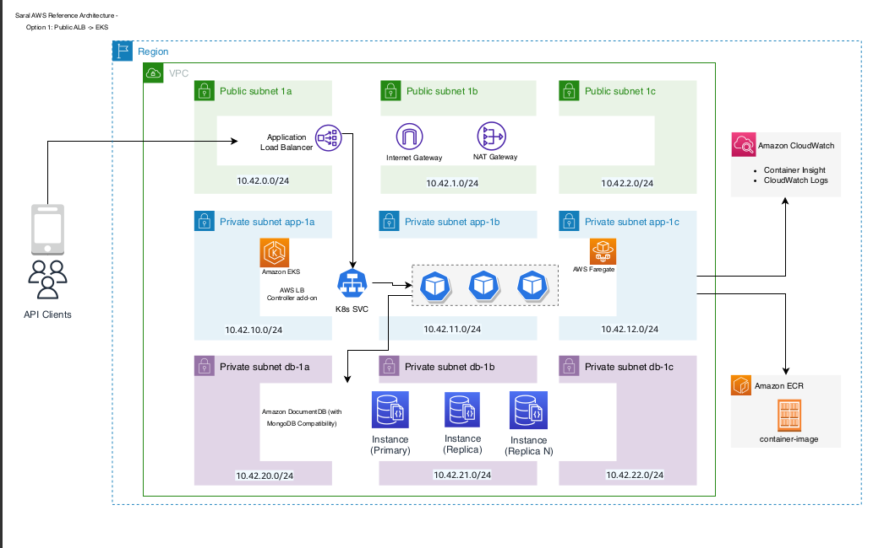

# What automation does

You should have the entire Saral Infra setup on you AWS account Infra structure Which Includes the following components

<table data-full-width="true"><thead><tr><th width="64">Sr No</th><th>Name of Resource  Provisioned</th></tr></thead><tbody><tr><td>1</td><td>
 EKS cluster with fargate Nodes

</td></tr><tr><td>2</td><td> VPC</td></tr><tr><td>3</td><td>Subnets (2-Private and 2-Public subnet for EKS cluster 2-Private subnets for Document DB)</td></tr><tr><td>4</td><td>Application load balancer controller</td></tr><tr><td>5</td><td>NAT gateway</td></tr><tr><td>6</td><td>Elastic IP</td></tr><tr><td>7</td><td>AWS document DB</td></tr></tbody></table>

The following is the reference architecture of the Infra provisioned by the installer

<figure><figcaption>
Saral AWS reference Architecture
</figcaption></figure>
