## Firstly We need an account of firebase to publish and download TFLite model
https://console.firebase.google.com/

### 1. Enter project name:
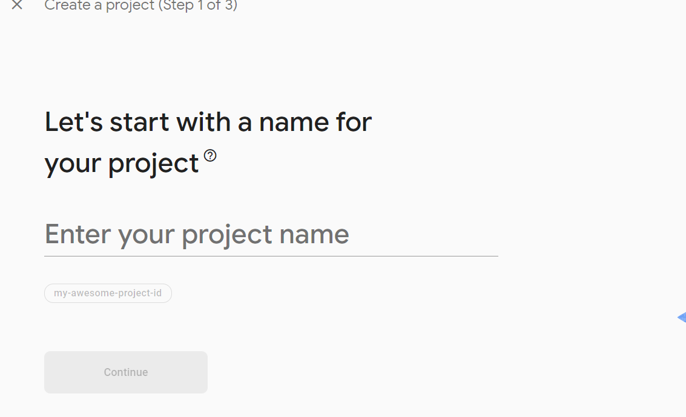

### 2. Press on Continue button:
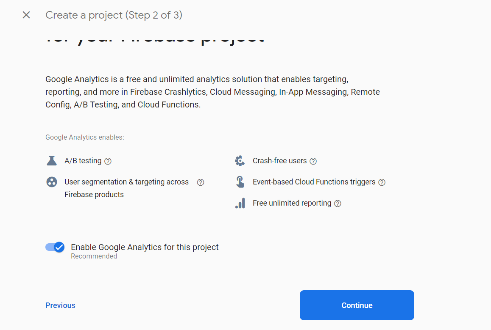

### 3. Select Account to continue:
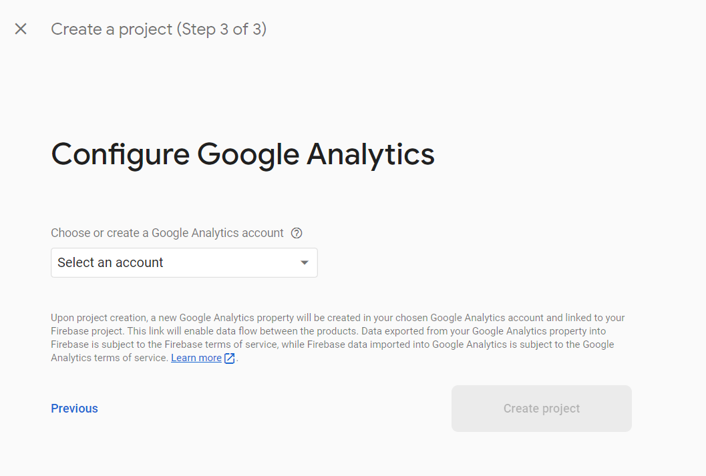

### 4. Press on continue button:
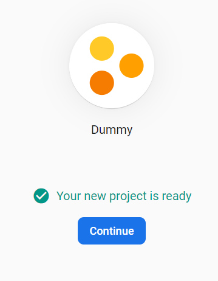

### 5. Click on Android:
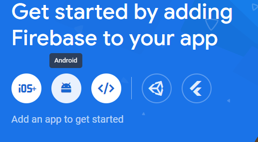

### 6. Add package name which will get from android/app/build.gradle file then once added package name click on Register button:
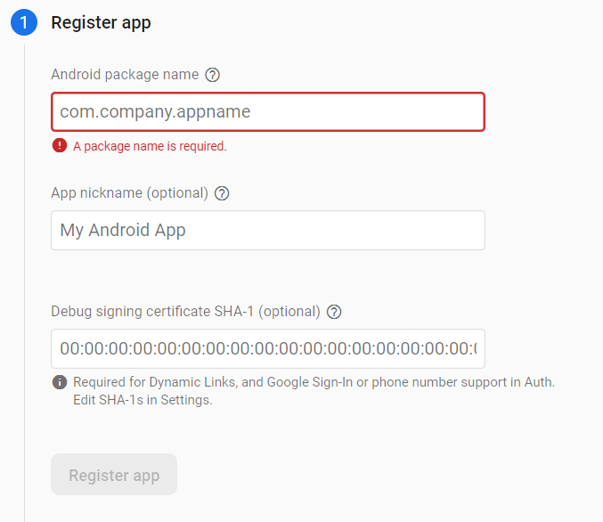

### 7. Download Service json file:
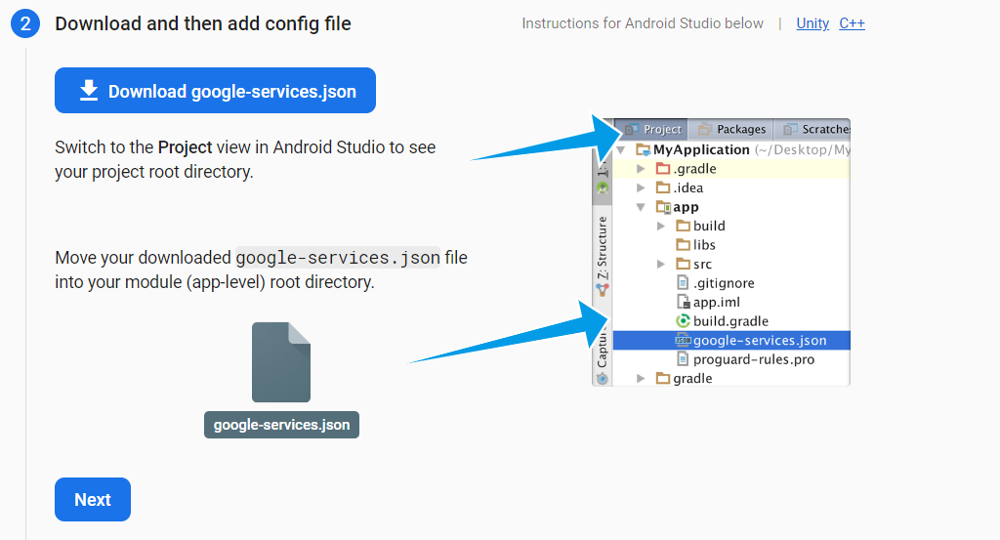

### 8. Do not add this dependency which is already added in project:
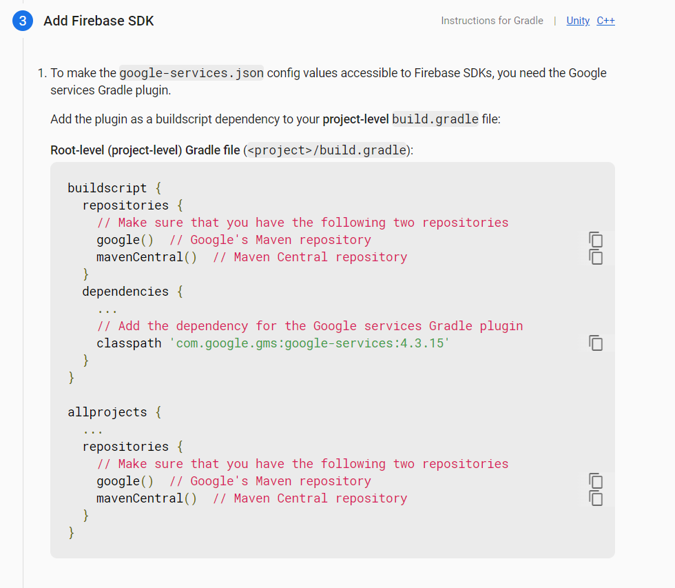

### 9. Press continue button:
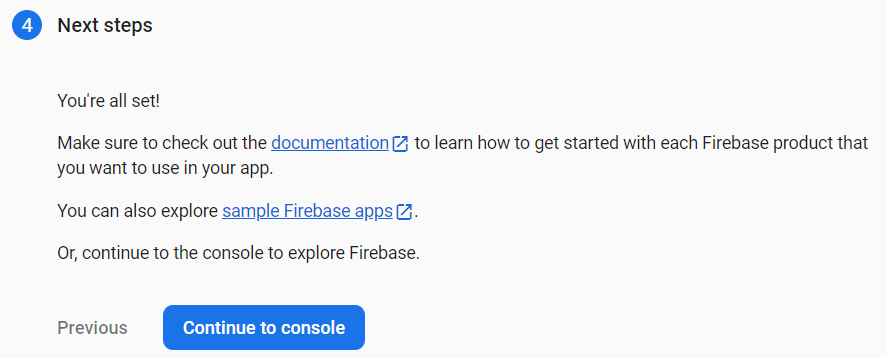

## Firebase setup for Remote configuration to enable TFLite model
i) If remote config flag is set as true in firebase.\
ii) Then tflite model will be downloaded in mobile once it's timer completed.\
iii) Timer can be change in RemoteConfig.java file.\
iv) Timer will be count in second.

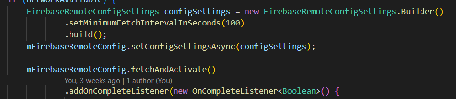

## There are some step for enable remote configuration which are listed below.
### 1. Press on Remote Config
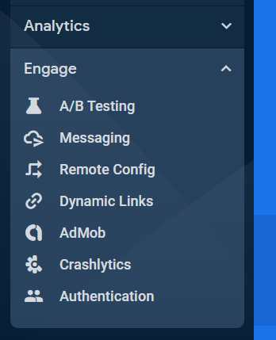

### 2. Press on Create Configuration
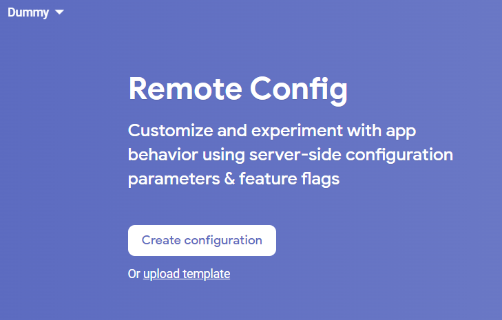

### 3. Add field name with its data type and save it:
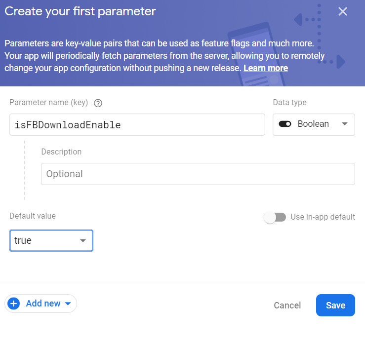

### 4. Click on Publish Changes
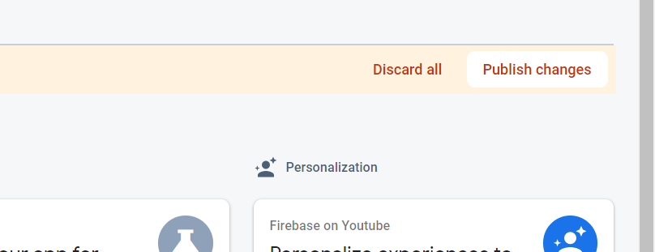
