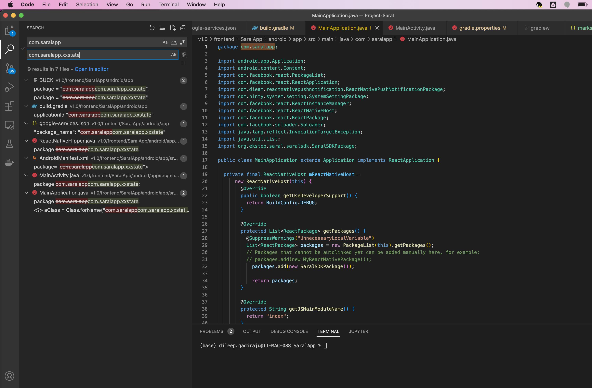

# Generating APK from source code

### Source Code references

> > Open Terminal and clone source code `git clone https://github.com/Sunbird-Saral/Project-Saral.git`
> >
> > `Refer`[source-code-repository.md](../engage/source-code-repository.md "mention")for latest repository location.

> > Change Directory to `Project-Saral/` folder and switch to release tag as per release notes. `git checkout tags/<tag_name>`

> > `$FRONTEND_FOLDER = Project-Saral/v1.0/frontend`

> > `$BACKEND_FOLDER = Project-Saral/v1.0/backend`

### Saral v1.0 Android App bundling/packaging

1. Follow Frontend Setup steps @ [workspace-setup-playbook.md](workspace-setup-playbook.md "mention")
2. Implementing Saral App for specific purpose , its recommended to change default package `com.saralapp`  references to implementation specific package for example `com.saralapp.xxstate` for xxstate. Refer below screenshot.                                                                                         &#x20;
3. App Icon can be customised/replaced by generating App icon using standard icon editors and replace icons in below folders.
   * $FRONTEND\_FOLDER\SaralApp\android\app\src\main\res\mipmap-mdpi
   * $FRONTEND\_FOLDER\SaralApp\android\app\src\main\res\mipmap-hdpi&#x20;
   * $FRONTEND\_FOLDER\SaralApp\android\app\src\main\res\mipmap-xhdpi&#x20;
   * $FRONTEND\_FOLDER\SaralApp\android\app\src\main\res\mipmap-xxhdpi&#x20;
   * $FRONTEND\_FOLDER\SaralApp\android\app\src\main\res\mipmap-xxxhdpi
4. Open Terminal in [**`$FRONTEND_FOLDER`**](generating-apk-from-source-code.md#source-code-references)`/SaralApp/android` folder

> > `./gradlew clean`

APK Signing can be enabled using the below Gradle files. Make sure the Keystore file is to be used for signing placed in [**`$FRONTEND_FOLDER`**](generating-apk-from-source-code.md#source-code-references)`/SaralApp/android/app` folder.

> > **``**[**`$FRONTEND_FOLDER`**](generating-apk-from-source-code.md#source-code-references)`/SaralApp/android/gradle.properties`

```
MYAPP_RELEASE_STORE_FILE=my-upload-key.keystore

MYAPP_RELEASE_STORE_PASSWORD=changeit

MYAPP_RELEASE_KEY_ALIAS=hwrecog-key-alias

MYAPP_RELEASE_KEY_PASSWORD=changeit
```

> > **``**[**`$FRONTEND_FOLDER`**](generating-apk-from-source-code.md#source-code-references)`/SaralApp/android/app/build.gradle`

**Note**: Make sure `signingConfig signingConfigs.release` the line is uncommented. Also set `enableSeparateBuildPerCPUArchitecture` flag to true to generate CPU architecture specific APKs. This will also reduce the size of the APK compared to universal APK.


```
    signingConfigs {
          release {
         if (project.hasProperty('MYAPP_RELEASE_STORE_FILE')) {
            storeFile file(MYAPP_RELEASE_STORE_FILE)
             storePassword MYAPP_RELEASE_STORE_PASSWORD
             keyAlias MYAPP_RELEASE_KEY_ALIAS
             keyPassword MYAPP_RELEASE_KEY_PASSWORD

             // Optional, specify signing versions used
               v1SigningEnabled true
               v2SigningEnabled true
         }
     }
         debug {
             storeFile file('debug.keystore')
             storePassword 'android'
             keyAlias 'androiddebugkey'
             keyPassword 'android'
         }
     }

    buildTypes {
        debug {
            signingConfig signingConfigs.release
        }
        release {
            signingConfig signingConfigs.release
            /* These are optional params to shrink the app size*/
            shrinkResources enableProguardInReleaseBuilds
            zipAlignEnabled enableProguardInReleaseBuilds
            useProguard enableProguardInReleaseBuilds

            minifyEnabled enableProguardInReleaseBuilds
            minifyEnabled true
            shrinkResources true
            /* These are optional params to shrink the app size*/
                                    
            debug {
                debuggable true
            }
        }
    }
```

1. Update `google-services.json` file in [**`$FRONTEND_FOLDER`**](generating-apk-from-source-code.md#source-code-references)`/SaralApp/android/app` folder.
2. Edit [**`$FRONTEND_FOLDER`**](generating-apk-from-source-code.md#source-code-references)`/SaralApp/src/config/config.js` to change apkVersionId , apkURL, BASE\_URL as per the implementation.&#x20;
3. Open Terminal in [**`$FRONTEND_FOLDER`**](generating-apk-from-source-code.md#source-code-references)`/SaralApp/android` folder

> > `./gradlew assembleRelease`

(OR)

> > `./gradlew assembleDebug`

3\. You can find the release apk file in `Project-Saral/v1.0/frontend/SaralApp/android/app/build/outputs/apk/release or debug` folder.

**Note:** If releasing APK file for a client/implementation, its recommended to build APK from the release tag and modify implementation-specific **BASE\_URL** entry and `google-services.json` file.

1. Open terminal from [**`$FRONTEND_FOLDER`**](generating-apk-from-source-code.md#source-code-references)`/SaralApp/android` folder and execute the below command to verify apk signature.

`jarsigner -verbose -verify ./app/build/outputs/apk/release/app-release.apk`
