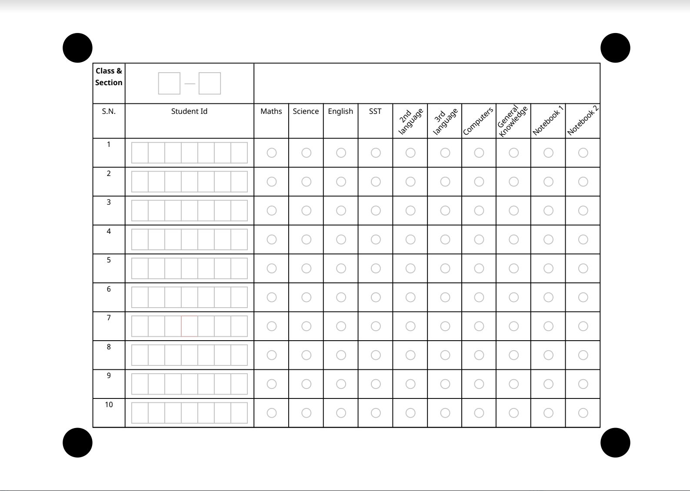

# Layout Design Guidelines

Below are the guidlines to design layouts compatible with `Saral App` and `SaralSDK`.

&#x20;    Alignment Circle Radius Width – 36px & Height 36px Border Radius – 100px or use directly Circle shape. These alignment circles should be present in the corners of the overall table area to be able to facilitate scanning the sheet.

&#x20;  Box for informational fields(Can’t be scanned): Width – 26px & Height 26px Border Color - #C2C2C2 Fill Color - #ffffff

  Box for Handwritten Digit or Block Letter: Width – 21px & Height 26px Border Color - #C2C2C2 Fill Color - #ffffff

   OMR Bubble Width – 12px & Height - 12px Border Radius – 100px or use directly Circle shape Fill Color - #ffffff, Border Color - #C2C2C2

  Row & Column Width – 41px, Height-41px Border – 1px, Border Color - #000

**Text** Font Name – “Noto Sans”, Color- #707070, Font Size – 9px (Optional, can use other fonts and colors)

**Page Size** – Custom Size, Maximum Dimension In MM - Maximum Width – 842 mm & Maximum Height- 595 mm Dimension In Inch - Maximum Width – 33 inch & Maximum Height- 24 inch Dimension In Pixel (300ppi/dpi) - Maximum Width – 3182 pixel & Maximum Height- 2248 pixel Mode - Landscape

Refer some of the layouts designed and used in `Saral` implementations.

  

 

